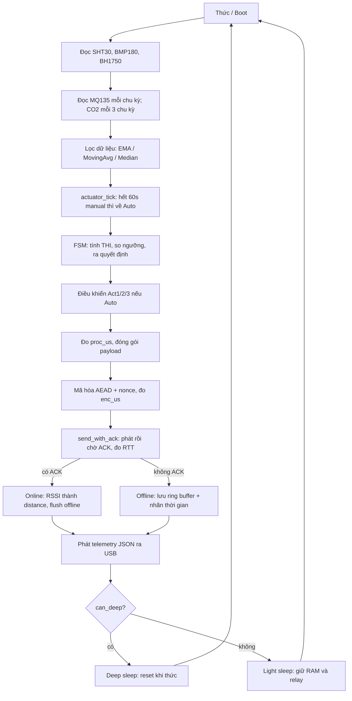
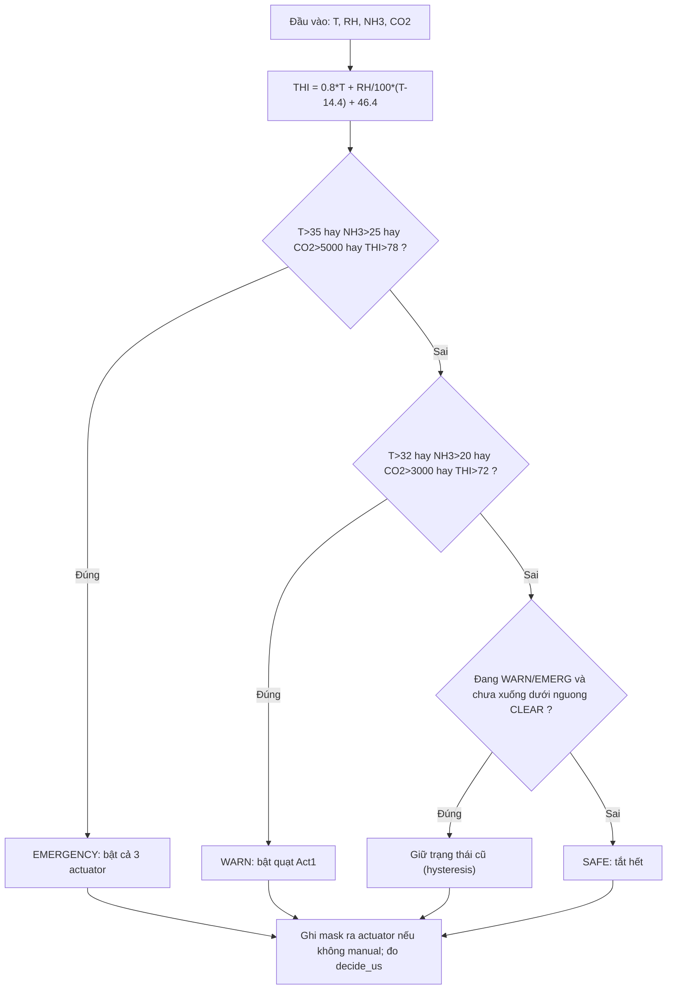
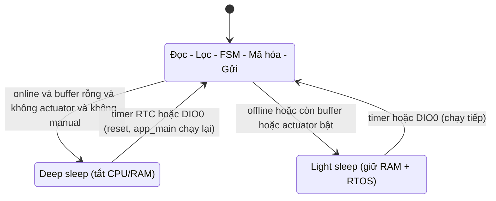
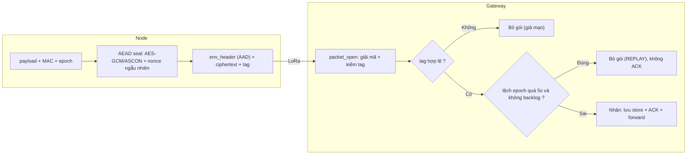
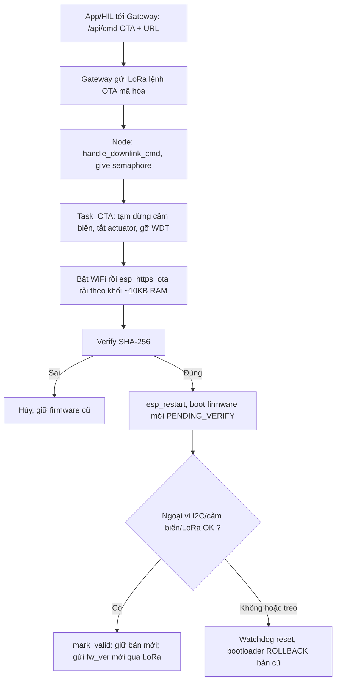

# TÀI LIỆU ÔN TẬP BẢO VỆ ĐỒ ÁN
### Hệ thống giám sát vi khí hậu chăn nuôi dùng LoRa + Edge Computing (ESP32-S3)

> Lưu đồ dưới đây viết bằng **Mermaid** — xem đẹp trên GitHub hoặc VS Code (cài extension "Markdown Preview Mermaid Support"). Mọi tham chiếu code ghi dạng `file:hàm`. Số dòng có thể lệch chút nếu bạn sửa thêm.

---

## A. "PITCH" 60 GIÂY (nói khi mở đầu)
Hệ thống gồm 3 tầng: **Node (ESP32-S3)** đọc cảm biến vi khí hậu (nhiệt, ẩm, áp suất, ánh sáng, NH₃, CO₂), **xử lý ngay tại biên (edge computing)** để tự ra quyết định điều khiển quạt/phun sương, rồi **mã hóa AES-128-GCM/ASCON-128** và gửi qua **LoRa** về **Gateway (ESP32)**. Gateway giải mã, kiểm tra chống phát lại, lưu vào **server nội bộ** và phục vụ **App/Web** (dashboard + điều khiển + OTA). Điểm nhấn: edge computing giảm độ trễ điều khiển, bảo mật AEAD + chống replay, cập nhật firmware từ xa OTA có rollback, và công cụ kiểm thử HIL tự viết.

---

## B. HỎI – ĐÁP CHI TIẾT

### 1) Node ID và MAC được set như thế nào trong code?
**MAC** = địa chỉ phần cứng duy nhất của mỗi chip, đọc từ eFuse:
- `crypto_get_mac()` trong **crypto.c**: gọi `esp_read_mac(mac, ESP_MAC_WIFI_STA)` → 6 byte MAC gốc, cố định suốt đời chip.

**Node ID** (1..254) **tự sinh từ MAC**, không cần đặt tay:
- `crypto_node_id_from_mac()` trong **crypto.c**:
  ```c
  uint8_t x = 0;
  for (i=0..5) x ^= mac[i];      // XOR 6 byte MAC thành 1 byte
  id = (x % 254) + 1;            // ép về 1..254 (tránh 0 và 255=broadcast)
  ```
- Trong `app_main()` (**main.c**):
  ```c
  crypto_get_mac(s_mac);
  #if CONFIG_NODE_ID_FROM_MAC
      s_node_id = crypto_node_id_from_mac();   // mặc định BẬT
  #else
      s_node_id = CONFIG_NODE_ID;              // fallback: đặt tay trong menuconfig
  #endif
  ```
- Bật/tắt ở `menuconfig → Node Sensor Configuration → "Dinh danh Node theo MAC"` (`CONFIG_NODE_ID_FROM_MAC`, mặc định `y`).

**Vì sao dùng MAC?** Mỗi mạch tự có ID riêng khi triển khai nhiều node, không lo trùng, không cần nạp code khác nhau cho từng node. MAC **6 byte được nhét vào payload đã mã hóa** → được xác thực bởi tag AEAD → **chống giả mạo định danh** (kẻ gian không thể mạo danh node khác vì không có khóa để tạo tag hợp lệ).

*Có thể hỏi thêm:* "Nếu 2 node XOR ra trùng ID thì sao?" → Xác suất thấp; nếu trùng có thể chuyển sang lấy nhiều byte hơn hoặc đặt tay qua `CONFIG_NODE_ID`. MAC đầy đủ vẫn phân biệt được ở tầng App.

---

### 2) Đối chiếu thông số thế nào để biết giá trị đo là chính xác?
Có **4 lớp kiểm chứng**:
1. **Kiểm tra dải hợp lý (sanity range)** — kịch bản HIL "Sensor Sanity Check": nhiệt −40..85°C, ẩm 0..100%, áp 800..1100 hPa. Ngoài dải → cảm biến lỗi.
2. **Đối chiếu chéo giữa cảm biến** — cả **SHT30** và **BMP180** đều đo nhiệt độ (`sht_temp_c` vs `bmp_temp_c` trong payload). Hai giá trị phải gần nhau (~±1–2°C); lệch nhiều ⇒ một cảm biến sai. DS3231 cũng có cảm biến nhiệt nội (`ds3231_read_temp`) để đối chiếu thêm.
3. **Raw vs Filtered** — công cụ HIL vẽ **cả đường thô (nét đứt) và đã lọc (nét liền)**; đường lọc bám xu hướng, gạt nhiễu → thấy rõ nhiễu điện tử hay đột biến.
4. **So với thiết bị chuẩn** — đặt cạnh nhiệt/ẩm kế đã hiệu chuẩn, so trực tiếp. Với **MQ135** có hàm `mq135_calibrate()` chốt Ro trong không khí sạch; **CO₂ MH-Z19** có ABC (tự hiệu chuẩn nền).

Ngoài ra mỗi cảm biến có **kiểm tra tồn tại** (I2C probe / CRC): `sensors_init()` tự dò địa chỉ, đọc lỗi thì đặt cờ invalid (`PKT_F_*_OK`) chứ không gửi số rác.

---

### 3) Các bài test thực hiện như thế nào? (công cụ HIL EdgeProfiler)
Công cụ tự viết (Python/PyQt5) đọc telemetry JSON qua USB, có **bộ chạy kịch bản tự động**. Mỗi kịch bản kiểm một chỉ tiêu:

| Kịch bản | Kiểm gì | PASS khi |
|---|---|---|
| Link & ACK Stability | Node gửi được + nhận ACK | online=1, RSSI hợp lệ |
| Latency / Response Time | RTT trong ngân sách | 0 < RTT < 4000ms |
| Encryption Active | Gói được mã hóa | algo ∈ {AES,ASCON}, enc_us>0 |
| Bandwidth (pkt/h) | Thông lượng | pph > 0 |
| Sensor Sanity Check | Giá trị hợp lý | trong dải chuẩn |
| Memory Leak Watch | Rò rỉ RAM | heap ~15s không tụt dần |
| Power / Sleep Mode | Có ngủ giữa chu kỳ | sleep_ms>0, mode∈{light,deep} |
| Watchdog Recovery | Tự phục hồi khi treo | chập GPIO0→GND, WDT reset, boot lại |
| Offline Buffering | Lưu-và-chuyển-tiếp | rút LoRa → buffer tăng → nối lại → buffer=0 |
| **OTA Update Test** | Cập nhật từ xa | node quay lại với **fw_ver mới** (chỉ cần cắm Gateway) |
| **LoRa Replay Attack** | Chống phát lại | bắt gói → chờ >5s → phát lại → **bị chặn** |

Báo cáo có **Verification Accuracy** = tỉ lệ test PASS; xuất HTML/Excel/XML để thống kê.

---

### 4) Công thức RSSI / THI / RTT / khoảng cách — tính trong code ở đâu, ý nghĩa, chỗ nào trong báo cáo?

**a. RSSI → Khoảng cách** (mô hình suy hao log-distance):
$$d = 10^{\frac{RSSI_{1m} - RSSI}{10 \cdot n}}$$
- Code: `estimate_distance_dm()` trong **main.c**, hằng `RSSI_REF_1M = -43 dBm` (RSSI đo ở 1m), `PATH_LOSS_N = 2.7` (hệ số môi trường: 2 = không gian tự do, 3–4 = trong nhà nhiều vật cản).
- Ý nghĩa: ước lượng cự ly node↔gateway để đánh giá vùng phủ; **cần hiệu chuẩn** `RSSI_REF_1M` theo antenna thực.
- Báo cáo: **Chương 4** mục "Triển khai truyền thông LoRa" — phương trình log-distance path loss.

**b. THI (Temperature–Humidity Index)** — chỉ số stress nhiệt cho gà:
$$THI = 0.8 \cdot T + \frac{RH}{100}(T - 14.4) + 46.4$$
- Code: `compute_thi()` trong **fsm.c**.
- Ý nghĩa: gộp nhiệt + ẩm thành 1 chỉ số đánh giá "cảm giác nóng" của vật nuôi; THI cao ⇒ stress nhiệt.
- Báo cáo: **Chương 4**, đoạn mã `lst:fsm` (lõi FSM).

**c. RTT (Round-Trip Time)** — độ trễ khứ hồi node→gateway→ACK:
- Code: `send_with_ack()` **main.c**: ghi `t_tx = esp_timer_get_time()` ngay trước khi phát; khi nhận ACK: `rtt = (esp_timer_get_time() - t_tx)/1000` (ms).
- Ý nghĩa: sức khỏe đường truyền + độ trễ phản ứng; RTT tăng ⇒ nhiễu/khoảng cách xa/mất gói.
- Báo cáo: **Chương 4** mục ACK.

**d. PDR (Packet Delivery Ratio)**: `pdr = ack_total / tx_total × 100%` (node tự đếm). 100% = không mất gói.

**e. proc_us / enc_us / decide_us** — đo bằng `esp_timer_get_time()` (bộ đếm µs độ phân giải cao):
- `proc_us`: thời gian đọc cảm biến + dựng gói.
- `enc_us`: thời gian **mã hóa** riêng (đo quanh `packet_seal`) → **so AES vs ASCON** định lượng.
- `decide_us`: thời gian **FSM ra quyết định** (đo quanh `fsm_update`) → chứng minh **độ trễ edge computing** rất nhỏ (µs).

---

### 5) Các ngưỡng dựa vào đâu để quyết định? Dòng ngủ/thức, độ trễ dựa tiêu chuẩn nào?
**Ngưỡng vi khí hậu (nhiệt/ẩm/NH₃/CO₂/THI)** — trong **fsm.c** (`#define T_EMERG 35`, `THI_EMERG 78`, `NH3_EMERG 25`, `CO2_EMERG 5000`…). Nguồn:
- **Tiêu chuẩn chăn nuôi gia cầm** (nhiệt độ úm, ngưỡng stress nhiệt, giới hạn NH₃/CO₂ trong chuồng kín) — trình bày ở **Chương 1 (thông số môi trường chăn nuôi)** và **Bảng ngưỡng ở Chương 3** của báo cáo. Ví dụ: NH₃ > 25 ppm gây hại hô hấp; THI > 78 là ngưỡng stress nhiệt cho gà; CO₂ nên < 3000–5000 ppm.
- Có thể trích các tài liệu tiêu chuẩn (VD khuyến cáo của nhà chăn nuôi/FAO) trong phần tài liệu tham khảo.

**Ngưỡng thời gian / độ trễ:**
- **Chu kỳ 3–4s** (`NODE_SEND_INTERVAL_S`): đủ nhanh để phản ứng vi khí hậu (biến đổi chậm) mà airtime LoRa vẫn ngắn.
- **Điều khiển < 50ms**: chỉ tiêu tới hạn nêu ở báo cáo (từ lúc vượt ngưỡng đến khi đóng relay) — thực đo `decide_us` chỉ ~µs nên thừa sức đạt.
- **ACK timeout 800ms, retry 2**: để tổng chu kỳ gói gọn trong vài giây.
- **Cửa sổ chống replay 5s** (`REPLAY_WINDOW_S`): đủ dung sai lệch đồng hồ RTC↔SNTP mà vẫn chặn gói phát lại.

**Dòng ngủ/thức:** chỉ tiêu **deep sleep vài µA (riêng MCU)** theo datasheet ESP32-S3; báo cáo nêu rõ **điểm đánh đổi** trung thực: cuộn nung cảm biến khí MOX (MQ135) mới là phần chi phối dòng chờ, không phải MCU.

---

### 6) Đánh giá RAM, CPU thực hiện thế nào trong code?
**RAM (heap):**
- `esp_get_free_heap_size()` → RAM trống hiện tại, gửi trong telemetry (`heap_kb`). Theo dõi theo thời gian → phát hiện **rò rỉ bộ nhớ** (kịch bản Memory Leak Watch).
- Phân mảnh = hiệu giữa tổng trống và khối liên tục lớn nhất (`heap_caps_get_largest_free_block`) — nêu trong báo cáo.

**Stack từng task:** `uxTaskGetStackHighWaterMark()` → lượng stack **còn trống ít nhất** mỗi task từng chạm; gần 0 ⇒ nguy cơ tràn stack.

**CPU:**
- **Node** — 2 cách:
  1. `s_cpu_pct = awake_ms / (awake_ms + sleep_ms)` — %CPU dựa trên tỉ lệ thức/ngủ (dễ hiểu cho báo cáo năng lượng).
  2. `rtos_stats.c` (`uxTaskGetSystemState`) — %CPU **từng lõi** qua run-time counter của task IDLE0/IDLE1: `cpu = 100 - idle%`. Đồng thời liệt kê từng task (tên, %CPU, core, stack còn, prio, trạng thái) → panel RTOS Profiler.
- **Gateway** — `cpu_load.c`: đăng ký **idle hook** cho từng core, đếm số lần idle chạy trong 1 giây (hiệu chuẩn lúc rảnh), rồi `load% = 100 - idle_count/calib`.

---

### 7) Thay đổi cấu hình chân (pinout) như thế nào?
Toàn bộ chân định nghĩa trong **board_pins.h** (mỗi project 1 file):
- **Node** (`NodeSensor_test/main/board_pins.h`): I2C (SDA8/SCL14, SDA6/SCL7), LoRa SPI (SCK10/MISO11/MOSI12/NSS13/RST9/DIO0 15), MQ135 (IO16), DS3231 SQW (IO1), CO2 UART (RX5/TX4), **Act1=38/Act2=42/Act3=45**, LED 39/40/41.
- **Gateway** (`LoraGateway/main/board_pins.h`): LoRa (SCK18/MISO19/MOSI23/NSS5/RST27/DIO0 26), OLED (SDA21/SCL22).
→ **Chỉ đổi `#define PIN_xxx` là xong**, không phải sửa logic. Lưu ý ESP32 tránh GPIO34–39 (chỉ input), 6–11 (nối flash); ESP32-S3 chân >21 không phải RTC (ảnh hưởng deep-sleep hold).

---

### 8) Chỉnh sửa bản tin (gói tin) LoRa như thế nào?
Cấu trúc gói ở **packet.h** — struct `app_payload_t` (phần được mã hóa). Muốn thêm/bớt trường:
1. Sửa `app_payload_t` trong **packet.h** (thêm field).
2. **Tăng `PKT_VERSION`** (hiện là 5) — để node/gateway lệch bản thì loại nhau, tránh đọc rác.
3. **Copy `packet.h` sang cả 2 project** (Node ↔ Gateway phải GIỐNG HỆT) — `packet.c`, `crypto.*`, `ascon.*` cũng vậy.
4. Node **ghi** field mới (trong `sensor_cycle_task`), Gateway **đọc/forward** (trong `emit_node_line` + `node_store`).
5. Kiểm tra tổng kích thước: `env_header(22) + sizeof(app_payload_t) + tag(16) ≤ 128` (giới hạn FIFO LoRa `SX127X_MAX_PAYLOAD`).
> Cấu trúc trên đường truyền: `[env_header (bản rõ = AAD)] [ciphertext] [tag 16B]`. Header để bản rõ (magic, version, algo, node_id, plen, nonce) nhưng **được xác thực qua AAD**.

---

### 9) Điều chỉnh ngưỡng các thông số trong code?
Trong **fsm.c** — các `#define` (đơn vị: °C, ppm, THI×1):
```c
#define T_EMERG 35   #define T_WARN 32   #define T_CLEAR 30
#define NH3_EMERG 25 #define NH3_WARN 20 #define NH3_CLEAR 18
#define CO2_EMERG 5000 #define CO2_WARN 3000 #define CO2_CLEAR 2500
#define THI_EMERG 78 #define THI_WARN 72 #define THI_CLEAR 70
```
- `*_EMERG`/`*_WARN`: ngưỡng **lên** trạng thái nguy hiểm hơn.
- `*_CLEAR`: ngưỡng **xuống** (thấp hơn) → tạo **hysteresis** chống rung relay.
Sửa số → `idf.py build flash`. (Chu kỳ lấy mẫu chỉnh ở `NODE_SEND_INTERVAL_S` trong menuconfig.)

---

### 10) Tính khoảng cách / thời gian truyền / độ trễ trong code?
- **Khoảng cách**: `estimate_distance_dm()` (mục 4a).
- **RTT (khứ hồi)**: `send_with_ack()` — hiệu 2 mốc `esp_timer` (mục 4c).
- **Thời gian xử lý/mã hóa/quyết định**: `proc_us / enc_us / decide_us` — bọc `esp_timer_get_time()` quanh đoạn cần đo (mục 4e).
- **Airtime LoRa** (thời gian phát 1 gói) phụ thuộc SF/BW/CR/độ dài — cấu hình ở **Bảng 4.3** báo cáo (SF7–9, BW125k, CR4/5). Tính lý thuyết bằng công thức LoRa ToA nếu được hỏi.
- Mọi mốc thời gian tuyệt đối dùng **RTC DS3231** (`ds3231_get_epoch`) → nhãn thời gian gói, chống replay, lưu offline đúng thời điểm.

---

### 11) App/Web: chức năng, cách dùng, liên kết firmware node & gateway thế nào?
**Hai dạng web:** (a) **Dashboard nhúng sẵn trong Gateway** — mở `http://<IP-gateway>/`, không cần cài gì; (b) **App React** (`app/`) chạy `npm run dev`, build được **APK**.

**Chức năng:** dashboard realtime từng node (nhiệt/ẩm/NH₃/CO₂/THI/RSSI/RTT/decide/PDR/buffer), **phân quyền Admin/User**, điều khiển actuator, OTA, xem lịch sử (React).

**Liên kết firmware qua REST API của Gateway** (server nội bộ, KHÔNG Firebase):
| API | Firmware xử lý ở |
|---|---|
| `GET /api/nodes` | `node_store_json_list()` — dữ liệu node giải mã từ LoRa |
| `GET /api/history?node=` | `node_store_json_history()` — ring buffer RAM |
| `GET /api/status` | trạng thái gateway |
| `POST /api/login` | `h_login()` — kiểm tài khoản trong `gw_config.h` → trả role |
| `POST /api/cmd` | `h_cmd()` (cần header X-Token=admin pass) → `node_store_queue_cmd()` |

**Luồng điều khiển actuator/OTA** (App → Gateway → Node → Actuator):
1. App gọi `POST /api/cmd {node,cmd,act_mask,act_val,url}`.
2. Gateway đưa vào **hàng đợi lệnh** (`node_store_queue_cmd`).
3. Khi node đó **gửi gói lên**, `lora_rx_task` gọi `send_downlink_if_any()` → **mã hóa lệnh** (`cmd_seal`) và **gửi TRƯỚC ACK** qua LoRa.
4. Node nhận trong cửa sổ RX (`handle_downlink_cmd`), kiểm **chống replay lệnh** (`cmd_seq` tăng dần), rồi thực thi: bật/tắt actuator, chuyển Auto, hoặc kích OTA.
- Mã lệnh (`cmd`): 1=ACT_SET, 2=ACT_AUTO, 3=OTA, 4=REBOOT, 5=PING. Bit actuator: 1=Quạt, 2=Sương, 4=Act3.

**OTA hiển thị trên web:** node gửi `fw_ver`+`ota_epoch` qua LoRa; gateway ghi mốc khi gửi lệnh OTA → web hiện "OTA đang chạy" (node offline tải fw) rồi "OTA thành công v2→v3" (khi node quay lại với version mới) — **không cần cắm node**.

---

### 12) Quy trình Deep sleep / Light sleep — khi ngủ, khi thức, setup và chỉnh?
(Chi tiết + lưu đồ ở **Phần C**.) Tóm tắt:
- **3 chế độ** (`menuconfig → Che do ngu`): None / **Light (mặc định)** / Deep. Ánh xạ macro `NODE_SLEEP_MODE` (0/1/2) trong **main.c**.
- **Light** (`hybrid_light_sleep`): dừng CPU, **giữ RAM+RTOS**, thức bằng **timer** hoặc **DIO0** (gói LoRa đến). Thức xong chạy tiếp, không reset.
- **Deep** (`enter_deep_sleep`): tắt CPU/RAM, chỉ giữ RTC → **reset khi thức** (`app_main` chạy lại); biến `RTC_DATA_ATTR` sống sót, RAM thường mất.
- **Chọn deep hay light mỗi chu kỳ** (`node_sleep`): `can_deep = online && buffer rỗng && không actuator && không manual`; ngược lại dùng light.
- **Thời gian ngủ**: `sleep_ms = cycle_ms - awake_ms`, với `cycle_ms = NODE_SEND_INTERVAL_S×1000`. Đổi chu kỳ = đổi `NODE_SEND_INTERVAL_S`.
- **Đánh thức sự kiện**: chân `PIN_WAKE_EVENT` (=DIO0). Đổi trong board_pins.h.

---

### 13) Edge computing ở Node hoạt động thế nào? Xét tham số gì để bật/tắt từng actuator? Chỉnh so sánh ngưỡng ở đâu?
**Edge computing** = node **tự lọc dữ liệu + tự tính THI + tự chạy FSM ra quyết định điều khiển ngay tại chỗ**, không chờ server → độ trễ µs, vẫn hoạt động cả khi mất kết nối.

**FSM 3 trạng thái** (`fsm_update` trong **fsm.c**), xét đồng thời **nhiệt độ, THI, NH₃, CO₂**:
| Trạng thái | Điều kiện (bất kỳ đúng) | Actuator |
|---|---|---|
| EMERGENCY | T>35 **hoặc** NH₃>25 **hoặc** CO₂>5000 **hoặc** THI>78 | **cả 3** (quạt+sương+Act3) |
| WARN | T>32 **hoặc** NH₃>20 **hoặc** CO₂>3000 **hoặc** THI>72 | **Act1 (quạt)** |
| SAFE | đều dưới ngưỡng CLEAR | tắt hết |
- **Hysteresis**: đã vào WARN/EMERGENCY thì phải **xuống dưới `*_CLEAR`** mới hạ trạng thái → chống relay đóng/cắt liên tục quanh ngưỡng.
- **Manual override**: nếu App bật manual thì FSM **chỉ tính trạng thái** (để báo cáo) chứ không ghi đè chân; hết 60s tự về Auto (`actuator_tick`).
- **Chỉnh cách so sánh ngưỡng**: sửa hàm `fsm_update()` trong **fsm.c** — thay điều kiện `if (... > T_EMERG ...)`, đổi ánh xạ `mask = ACT1_BIT | ...`, hoặc thêm cảm biến khác vào `fsm_input_t`.

---

## C. LƯU ĐỒ THUẬT TOÁN

### C.1 Chu trình một chu kỳ của Node


### C.2 FSM điều khiển biên (edge decision)


### C.3 Máy trạng thái ngủ (Hybrid Sleep)


### C.4 Bảo mật: mã hóa + chống replay


### C.5 OTA (Hybrid, có rollback)


---

## D. GIẢI THÍCH TỪNG FILE CODE

### D.1 NODE (`NodeSensor_test/main/`)
| File | Vai trò & điểm chính | Cách modify |
|---|---|---|
| **main.c** | Vòng đời node: `app_main` (khởi tạo, đọc MAC→ID, WDT, OTA rollback self-check, tạo task) + `sensor_cycle_task` (chu trình 1 chu kỳ) + `send_with_ack` (phát+ACK+RTT) + `handle_downlink_cmd` (nhận lệnh) + `node_sleep`/`hybrid_light_sleep`/`enter_deep_sleep` + `node_emit_telemetry` (JSON). | Chỉnh chu trình, thêm cảm biến, đổi telemetry |
| **board_pins.h** | Bản đồ chân + `LORA_SYNC_WORD/BW/CR`, `ACT_ON_LEVEL` (0=relay active-low) | Đổi chân, mức relay |
| **packet.h / packet.c** | Định nghĩa `app_payload_t`, `cmd_payload_t`, ACK; `packet_seal/open`, `cmd_seal/open` (dựng/mở phong bì AEAD) | Thêm trường gói (nhớ bump PKT_VERSION + copy sang gateway) |
| **crypto.h / crypto.c** | Lớp AEAD thống nhất (AES-128-GCM qua PSA, ASCON-128); MAC/ID; `crypto_derive_key` (HMAC-SHA256 PSA) | Đổi thuật toán, khóa |
| **crypto_cfg.h** | Chọn `CRYPTO_ALGO` + `CRYPTO_KEY` 16 byte | Đổi thuật toán/khóa (node=gateway) |
| **ascon.c/.h** | ASCON-128 lightweight AEAD (phần mềm thuần) | — |
| **fsm.c / fsm.h** | Edge FSM: `compute_thi`, `fsm_update`, ngưỡng, hysteresis, đo `decide_us` | Chỉnh ngưỡng, logic điều khiển |
| **actuator.c/.h** | Điều khiển Act1-3, `gpio_hold` (chống nháy), manual có hạn 60s (`actuator_tick`) | Đổi số kênh, timeout manual |
| **sht3x / bmp180 / bh1750 / ds3231 / mq135 / mhz19** (.c/.h) | Driver cảm biến (I2C/ADC/UART) | Thêm/đổi cảm biến |
| **filters.c/.h** | Bộ lọc: EMA (nhiệt/ẩm), MovingAvg (áp), Median (sáng) | Đổi bộ lọc/cửa sổ |
| **sx127x.c/.h** | Driver LoRa SX1278 (SPI): init, send, start_rx, receive (RSSI/SNR) | Đổi tham số PHY |
| **ota_update.c/.h** | `esp_https_ota` theo khối + báo % + rollback | Đổi nguồn firmware |
| **wifi_node.c/.h** | WiFi STA chỉ bật khi OTA | Đổi SSID/PASS |
| **rtos_stats.c/.h** | %CPU từng core + bảng task FreeRTOS (JSON) | — |
| **app_version.h** | `NODE_FW_VERSION` — **bump mỗi bản OTA** | Tăng số trước khi build OTA |

### D.2 GATEWAY (`LoraGateway/main/`)
| File | Vai trò | Modify |
|---|---|---|
| **main.c** | `lora_rx_task` (nhận→giải mã→**chống replay**→lưu store→**gửi downlink**→ACK→forward JSON) + `oled_task` + `gw_status_task` + `serial_on_line` (lệnh HIL) + `send_downlink_if_any` + `replay_reinject` (test replay) | Logic gateway |
| **board_pins.h** | Chân LoRa + OLED cho ESP32 DevKit | Đổi chân |
| **node_store.c/.h** | Kho RAM: latest + history + hàng đợi lệnh + theo dõi OTA; sinh JSON `/api/nodes`,`/api/history` | Thêm trường web |
| **http_server.c/.h** | Local server: REST API + dashboard nhúng + đăng nhập + CORS | Sửa API/dashboard |
| **ssd1306.c/.h** | Driver OLED (framebuffer + font 5x7) | — |
| **wifi_sta.c/.h** | WiFi STA vào LAN | SSID/PASS |
| **cpu_load.c/.h** | %CPU gateway qua idle hook | — |
| **gw_config.h** | WiFi, HTTP port, **tài khoản Admin/User**, tần số LoRa | Cấu hình nhanh |
| **serial_cmd.c/.h** | Nhận/gửi dòng lệnh qua UART cho HIL | — |
| *packet/crypto/ascon* | **Copy giống hệt Node** | Đồng bộ 2 bên |

### D.3 APP (`app/src/`)
| File | Vai trò |
|---|---|
| **api.js** | Client REST (base URL, login, nodes, history, cmd) + mã lệnh CMD/ACT |
| **App.jsx** | Khung: polling 2s, RBAC, toast, modal |
| **components/Login.jsx** | Đăng nhập + nhập IP gateway |
| **components/StatusBar.jsx** | Trạng thái gateway |
| **components/NodeCard.jsx** | Thẻ node + Auto/Manual + trạng thái OTA + toggle actuator |
| **components/NodeDetail.jsx** | Biểu đồ lịch sử (recharts) + điều khiển Act/AUTO/OTA/Reboot |

### D.4 HIL (`HIL_Tool/edge_profiler.py`)
`SerialWorker` (đọc COM, phân loại JSON) → `NodeData/GatewayData` (mô hình dữ liệu) → `TestSequencer` (11 kịch bản) → `MainWindow` (đồ thị realtime, RTOS profiler, record/replay, xuất HTML/Excel). Đóng gói `.exe` bằng `build_exe.bat` (PyInstaller).

---

## E. CÂU HỎI "BẪY" HAY GẶP — TRẢ LỜI NHANH
- **"Firmware có đi qua LoRa khi OTA không?"** → Không. LoRa chỉ mang **lệnh + URL** (vài chục byte). Node tải firmware **qua WiFi** của nó. LoRa quá chậm cho ~1MB.
- **"Deep sleep vài µA sao dòng thực vẫn cao?"** → Chỉ tiêu µA áp cho **riêng MCU**; cuộn nung MQ135 (MOX) chi phối dòng chờ — đã nêu là điểm đánh đổi trong báo cáo.
- **"Chống replay bằng gì? Sao AEAD chưa đủ?"** → AEAD chống **giả mạo/sửa** nhưng **không chống phát lại** gói y nguyên. Thêm **nhãn thời gian RTC + cửa sổ 5s**: gói cũ lệch giờ → bị loại. Lệnh downlink chống replay bằng `cmd_seq` tăng dần.
- **"Gateway đọc được node lạ không?"** → Không. Chỉ ai có **cùng `CRYPTO_KEY`** mới giải mã (tag sai → bỏ gói).
- **"Vì sao dùng cả AES lẫn ASCON?"** → So sánh định lượng: AES-128-GCM (chuẩn, tăng tốc phần cứng) vs ASCON-128 (thắng cuộc thi hạng nhẹ NIST, phần mềm thuần) — đo `enc_us` để đối chứng.
- **"Mất kết nối thì mất dữ liệu?"** → Không. **Store-and-forward**: lưu ring buffer + nhãn thời gian, nối lại thì gửi bù (cờ backlog, đúng timestamp gốc).
- **"OTA lỗi thì hỏng thiết bị?"** → Không. **Rollback**: firmware mới phải tự xác nhận ngoại vi OK; treo → watchdog reset → bootloader quay về bản cũ.
- **"Watchdog chứng minh thế nào?"** → Chập GPIO0→GND giả lập treo → Task WDT reset → reason=TASK_WDT, boot count tăng (quan sát trên HIL).
- **"Độ trễ edge bao nhiêu?"** → `decide_us` đo thực ~µs (rất nhỏ so với chỉ tiêu 50ms) vì FSM chỉ là vài phép so sánh dấu phẩy động.
- **"Tại sao lọc mỗi tín hiệu một kiểu?"** → EMA cho nhiệt/ẩm (quán tính lớn, bám xu hướng), MovingAvg cho áp (ủi nhiễu điện tử), Median cho sáng (gạt đột biến bóng/côn trùng).
```
```
